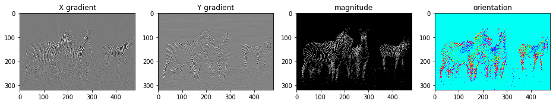
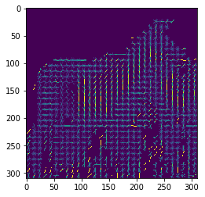
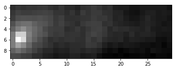

# Object Detection with HoG

## **1) Image Gradients**

Write a function that takes a grayscale image as input and returns two arrays the same size as the image, the first of which contains the magnitude of the image gradient at each pixel and the second containing the orientation. Your function should filter the image with the simple x- and y-derivative filters as question 2.1. Once you have the derivatives you can compute the orientation and magnitude of the gradient vector at each pixel. On the image boundaries, there should be zero gradients. Include a visualization of the output of your gradient calculate for a small test image. To display the orientation result, please uses a cyclic colormap such as ”hsv” or ”twilight” as in https://matplotlib.org/tutorials/colors/colormaps.html


```python
%matplotlib inline
import numpy as np
import matplotlib.pyplot as plt
import time
import cv2
from tqdm import tqdm
import skimage.draw
```


```python
def conv(x,w,stride=1,pad=0):
    w = np.flip(w)
    H, W = x.shape
    kH, kW = w.shape
    outH = 1 + (H + 2 * pad - kH) // stride
    outW = 1 + (W + 2 * pad - kW) // stride
    out = np.zeros((outH, outW))
    x_padded = np.pad(x, (pad,pad), 'edge')
    for row in range(outH):
        for col in range(outW):
            out[row, col] = np.sum(x[row*stride:row*stride+kH, col*stride:col*stride+kW] * w)
    return out
```


```python
def difference_filter(img):
    filterx = np.array([[1.,-1.]])
    filtery = np.array([[1.],[-1.]])
    xout = conv(img,filterx)[:-1]
    yout = conv(img,filtery)[:,:-1]
    out = np.stack([xout,yout],axis=2)
    mag = np.linalg.norm(out,axis=2)
    threshold = 0.15*mag.max()
    region = mag<threshold
    orientation = np.arctan(yout/(xout+1e-8))
    orientation[region]=0.0
    mag[region] = 0
    return mag,orientation,xout,yout,mag>threshold
```


```python
def normalize(array):
    return (array-array.min())/(array.max()-array.min())
```


```python
img = cv2.imread('question1/bsds_253027.jpg')
img = cv2.cvtColor(img,cv2.COLOR_BGR2GRAY)
mag,orientation,xout,yout,region = difference_filter(img)
xout = normalize(xout)
yout = normalize(yout)
#orientation = normalize(orientation)
mag = normalize(mag)
plt.figure(figsize = (16,3))
plt.subplot(141)
plt.title('X gradient')
plt.imshow(xout,cmap='gray')
plt.subplot(142)
plt.title('Y gradient')
plt.imshow(yout,cmap='gray')
plt.subplot(143)
plt.title('magnitude')
plt.imshow(mag,cmap='gray')
plt.subplot(144)
plt.title('orientation')
plt.imshow(orientation,cmap='hsv')
```


    <matplotlib.image.AxesImage at 0x12c2eecd0>





## **2) Histograms of Gradient Orientations**

Write a function that computes gradient orientation histograms over each 8 × 8 block of pixels in an image. Your function should bin the orientation into 9 equal sized bins between −π/2 and π/2. The input of your function will be an image of size H × W . The output should be a three-dimensional array whose size is (H/8) × (W/8) × 9. If the input image dimensions are not a multiple of 8, you should pad the image up to the nearest integer multiple of 8. To determine if a pixel is an edge, we need to choose some threshold. I suggest using a threshold that is 10% of the maximum gradient magnitude in the image. Since each 8 × 8 block will contain a different number of edges, you should normalize the resulting histogram for each block to sum to 1. Test your code on one of your own choice, computing the descriptor and using the provided function in hogvis.py to visualize it. Note: in the discussion above I have assumed 8x8 block size and 9 orientations. In your code you should use parameters in place of these constants.


```python
def hogvis(descriptor,bsize=8,norient=9):
    """
    This function visualizes a hog descriptor using little
    icons to indicate orientation. We follow the convention
    that the first orientation bin starts at a gradient 
    orientations of -pi/2 and the last bin ends at pi/2
    
    Parameters
    ----------
    descriptor : 3D float array 
         HOG descriptor values

    bsize : int
        The size of the spatial bins in pixels, defaults to 8
        
    norient : int
        The number of orientation histogram bins, defaults to 9
    
    Returns
    -------
    hog_image : 2D float array
        Visualization of the hog descriptor with oriented line segments.
        
    """   

    d_h = descriptor.shape[0]
    d_w = descriptor.shape[1]
    hog_image = np.zeros((d_h*bsize,d_w*bsize), dtype=float)
    
    #radius of a spatial bin
    radius = bsize // 2
    orient = np.arange(norient)

    #angle of bin mid-points 0..pi
    orient_angle = (np.pi * (orient + .5) / norient)
    
    #end points of a line at each orientation
    vr = -(radius-0.5) * np.cos(orient_angle)
    vc = (radius-0.5) * np.sin(orient_angle)

    for r in range(d_h):
        for c in range(d_w):
            for o, dr, dc in zip(orient,vr,vc):
                centre = tuple([r*bsize + radius, c*bsize + radius])
                rr, cc = skimage.draw.line(int(centre[0] - dc), int(centre[1] + dr),
                                          int(centre[0] + dc), int(centre[1] - dr))
                hog_image[rr,cc] += descriptor[r, c, o]

    return hog_image
```


```python
def histo(orientation,region,size = 8,bins = 10):
    row,col = orientation.shape
    row,col = int(np.ceil(row/size)),int(np.ceil(col/size))
    padr = row*size - orientation.shape[0]
    padc = col*size - orientation.shape[1]
    orientation = np.pad(orientation,((padr//2,padr-(padr//2)),(padc//2,padc-(padc//2))),'constant')
    region = np.pad(region,((padr//2,padr-(padr//2)),(padc//2,padc-(padc//2))),'constant')  
    hogmat = np.zeros((row,col,bins-1))
    for i in range(row):
        for j in range(col):
            roi = orientation[i*size:(i+1)*size,j*size:(j+1)*size]
            activ = region[i*size:(i+1)*size,j*size:(j+1)*size]
            if activ.sum()!=0:
                hist = np.histogram((roi[activ]*(bins-1)/np.pi) + 0.5*(bins-1),bins = range(bins),density=True)
                hogmat[i][j] = hist[0]
    return hogmat
```


```python
def HoG(img,size = 8,bins = 10):
    img = cv2.cvtColor(img,cv2.COLOR_BGR2GRAY)
    _,orientation,_,_,region = difference_filter(img)
    hogmat = histo(orientation,region,size,bins)
    return hogmat
```


```python
img = cv2.imread('question3/zebra.png')
hogmat = HoG(img)
hogim = hogvis(hogmat,bsize=10)
plt.imshow(hogim)
plt.show()
```





## **3) HoG detector**

Write a function that takes a template and an image and returns the top detections found in the image. Your function should follow the definition given below. In your function you should first compute the histogram-of-gradient-orientation feature map for the image, then correlate the template with the feature map. Since the feature map and template are both three dimensional, you will want to filter each orientation separately and then sum up the results to get the final response. If the image of size H × W then this final response map will be of size (H/8) × (W/8).When constructing the list of top detections, your code should implement non-maxima suppression so that it doesn’t return overlapping detections. You can do this by sorting the responses in descending order of their score. Every time you add a detection to the list to return, check to make sure that the location of this detection is not too close to any of the detections already in the output list. You can estimate the overlap by computing the distance between a pair of detections and checking that the distance is greater than say 70% of the width of the template. Please test your implementation on two simple test cases and include result visualization in the report.


```python
def correlation(x,w,stride=1,pad=0):
    H, W , C = x.shape
    kH, kW, kC = w.shape
    outH = 1 + (H + 2 * pad - kH) // stride
    outW = 1 + (W + 2 * pad - kW) // stride
    out = np.zeros((outH, outW))
    x_padded = np.pad(x, (pad,pad), 'edge')
    w_norm = np.linalg.norm(w,axis=(0,1))
    for row in range(outH):
        for col in range(outW):
            roi = x[row*stride:row*stride+kH, col*stride:col*stride+kW]
            roi_norm = np.linalg.norm(roi,axis=(0,1))
            out[row, col] = np.sum(np.sum(roi * w,axis=(0,1))/(w_norm*roi_norm))
    return out
```


```python
def hogdetector(img,template):
    window = HoG(template)
    whole = HoG(img)
    out = correlation(whole,window)
    return out
```


```python
img = cv2.imread('question1/bsds_253027.jpg')
template = cv2.imread('question3/zebra.png')
out = hogdetector(img,template)
```


```python
print(out.shape)
plt.imshow(out,cmap = 'gray')
```

    (10, 30)


    <matplotlib.image.AxesImage at 0x120934110>





```python

```
